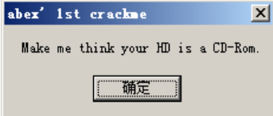
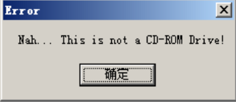
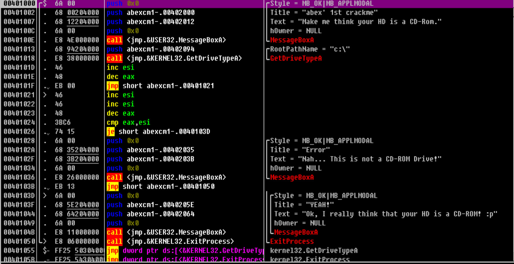
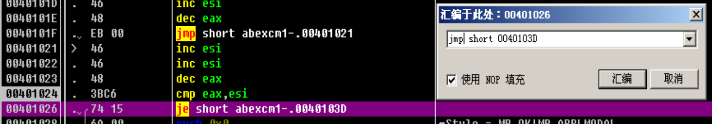

# 分析过程

## 运行

调试前先运行程序，大致了解

双击程序运行，显示“Make me think your HD is a CD-Rom”


点击确定，显示“Nah... This is not a CD-ROM Drive!”


弹出上述消息后，程序终止
我们把硬盘伪装成 CD-ROM 后，也许可以看到其他功能

## 开始调试

使用 OllyDbg 载入程序，可以看到代码窗口的汇编代码


EP 代码非常短，没有开发工具添加的启动函数，是由汇编语言编写的程序

### 分析代码

代码 + 注释

``` x86asm
; 调用 MessageBoxA() 函数
; MessageBox(NULL, "Make me think your HD is a CD-Rom.", "abex' 1st crackme", MB_OK|MB_APPLMODAL);
00401000 >/$  6A 00         push 0x0                                 ; /Style = MB_OK|MB_APPLMODAL
00401002  |.  68 00204000   push abexcm1-.00402000                   ; |Title = "abex' 1st crackme"
00401007  |.  68 12204000   push abexcm1-.00402012                   ; |Text = "Make me think your HD is a CD-Rom."
0040100C  |.  6A 00         push 0x0                                 ; |hOwner = NULL
0040100E  |.  E8 4E000000   call <jmp.&USER32.MessageBoxA>           ; \MessageBoxA
                                                                     ; 在函数内部 ESI 被设置为 FFFFFFFF

; 调用 GetDriveType("c:\") 函数
; GetDriveType()
00401013  |.  68 94204000   push abexcm1-.00402094                   ; /RootPathName = "c:\"
00401018  |.  E8 38000000   call <jmp.&KERNEL32.GetDriveTypeA>       ; \GetDriveTypeA
                                                                     ; 返回值 (EAX) 是 3 (DRIVE_FIXED)
0040101D  |.  46            inc esi                                  ; ESI = FFFFFFFF + 1 = 0
0040101E  |.  48            dec eax                                  ; EAX = 3 - 1 = 2
0040101F  |.  EB 00         jmp short abexcm1-.00401021              ; 无意义的 JMP 指令 (垃圾代码)，跳转至下一行的地址
00401021  |>  46            inc esi                                  ; ESI = 0 + 1 = 1
00401022  |.  46            inc esi                                  ; ESI = 1 + 1 = 2
00401023  |.  48            dec eax                                  ; EAX = 2 - 1 = 1

; 条件分支
00401024  |.  3BC6          cmp eax,esi                              ; 比较 EAX(1) 与 ESI(2)，相等返回 0
                                                                     ; 不改变操作数的值，该百 EFLAGS 寄存器中 ZF 的值
00401026  |.  74 15         je short abexcm1-.0040103D               ; JE(Jump if Equal) 条件分支命令
                                                                     ; 若两值相等，则跳转至 0x40103D
                                                                     ; 若两值不相等，则从 0x401028 继续执行
                                                                     ; 0x40103D 为消息框输出代码

; MessageBoxA() 函数调用输出 Error
; MessageBox(NULL, "Nah... This is not a CD-ROM Drive!", "Error", MB_OK|MB_APPLMODAL);
00401028  |.  6A 00         push 0x0                                 ; /Style = MB_OK|MB_APPLMODAL
0040102A  |.  68 35204000   push abexcm1-.00402035                   ; |Title = "Error"
0040102F  |.  68 3B204000   push abexcm1-.0040203B                   ; |Text = "Nah... This is not a CD-ROM Drive!"
00401034  |.  6A 00         push 0x0                                 ; |hOwner = NULL
00401036  |.  E8 26000000   call <jmp.&USER32.MessageBoxA>           ; \MessageBoxA
0040103B  |.  EB 13         jmp short abexcm1-.00401050              ; 跳转到 0x401050 
                                                                     ; 0x401050 为终止进程代码

; MessageBoxA() 函数调用输出 YEAH!
; MessageBox(NULL, "Ok, I really think that your HD is a CD-ROM! :p", "YEAH!", MB_OK|MB_APPLMODAL);
0040103D  |>  6A 00         push 0x0                                 ; |/Style = MB_OK|MB_APPLMODAL
0040103F  |.  68 5E204000   push abexcm1-.0040205E                   ; ||Title = "YEAH!"
00401044  |.  68 64204000   push abexcm1-.00402064                   ; ||Text = "Ok, I really think that your HD is a CD-ROM! :p"
00401049  |.  6A 00         push 0x0                                 ; ||hOwner = NULL
0040104B  |.  E8 11000000   call <jmp.&USER32.MessageBoxA>           ; |\MessageBoxA

; 终止进程
00401050  \>  E8 06000000   call <jmp.&KERNEL32.ExitProcess>         ; \ExitProcess
```

该程序输出第一个消息框并单击确定按钮后，获取 C 盘驱动器类型，然后对 EAX 和 ESI 寄存器进行加减后比较决定是否跳转
此程序通过栈传递参数时，最右侧的参数先入栈

## patch

将原本的跳转指令 JE 修改为 JMP，然后复制到可执行文件即可。

也可以将 JE 需要改为 JNZ
