# 分析过程

## 运行

调试前先运行程序，大致了解。

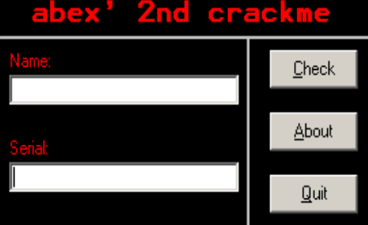

输入姓名 test 和序列号 test，提示序列号错误

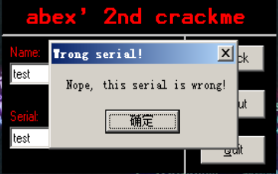

点击 about 会显示程序的编写时间

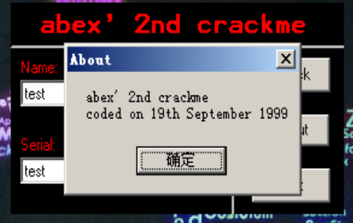

点击 quit 程序会退出

## 调试程序

使用 OllyDbg 调试 abex' crackme#2 文件

为了快速定位到需要分析的代码，可以先使用字符串查找功能，需按照相关字符串

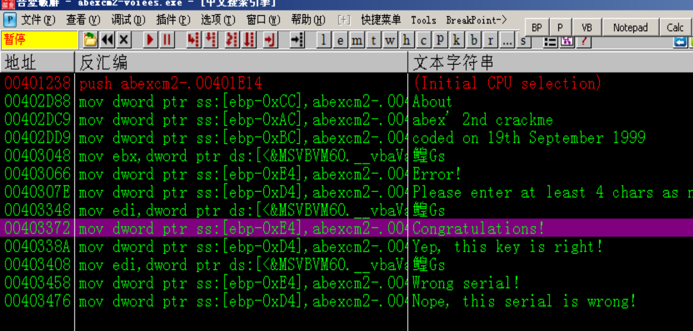

选一个运行程序时看到的字符串，双击运行选中字符串，跳转到对应程序地址

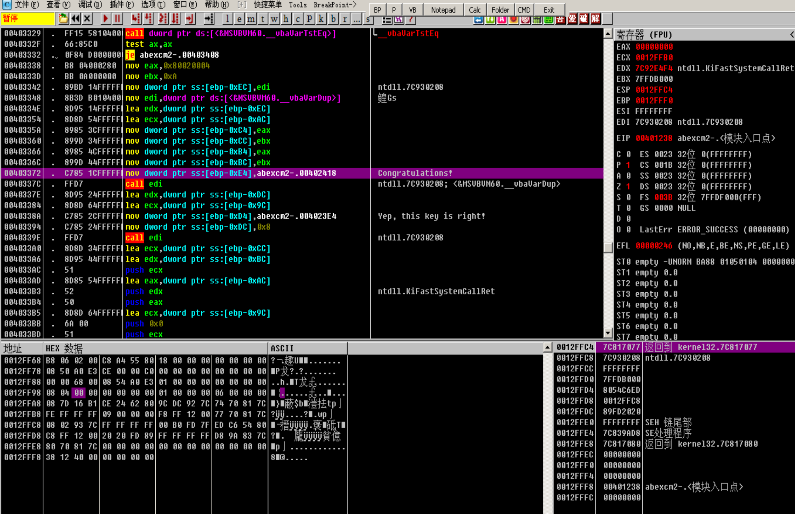

可以看到我们已经进入程序的主程序，在该语句前面应该有判断序列号正确与否的语句，并根据判断结果，跳转到不同的语句
往前面寻找对应语句，在 0x403332 处发现跳转语句 JE（若 ZF==1，则跳转）

该跳转语句前面是 比较命令 TEST（逻辑比较，按位进行与运算，仅改变 EFLAG 寄存器不改变操作数的值）

此处的 ax 是上一个函数 __vbaVarTstEq 的返回值，__vbaVarTstEq 应该是比较函数，它前面 push 的是比较的两个数

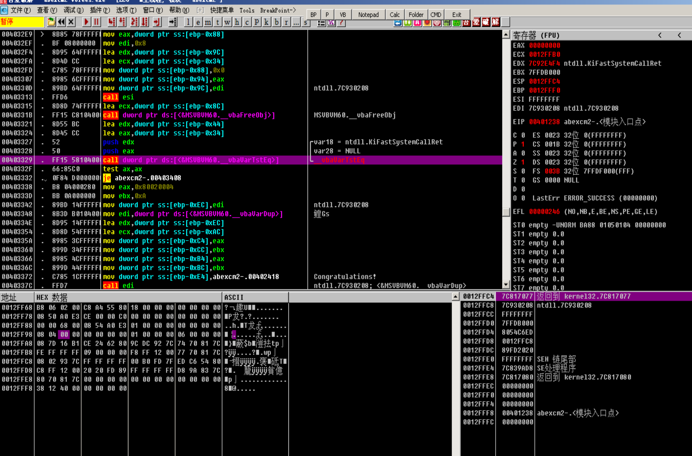

F4 执行到第一个 push 参数的地方，等两个参数 push 完毕后，查看堆栈窗口，右键 -> 数据窗口中跟随，可以查跳转到这两个参数在数据窗口的位置

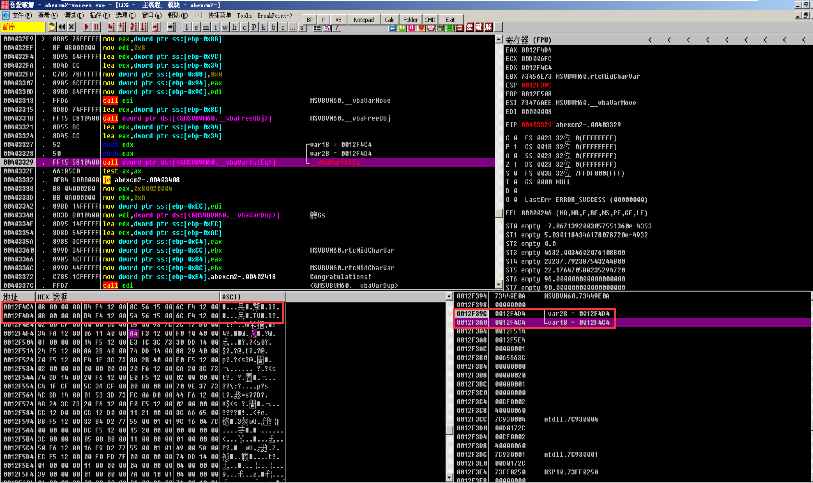

在数据窗口中，看到 ASCII 部分是乱码（因为 VB 中字符串使用的是字符串对象，而不是使用 char 数组），此时右键 -> 长型 -> ASCII 数据地址 可以查看对应的字符串

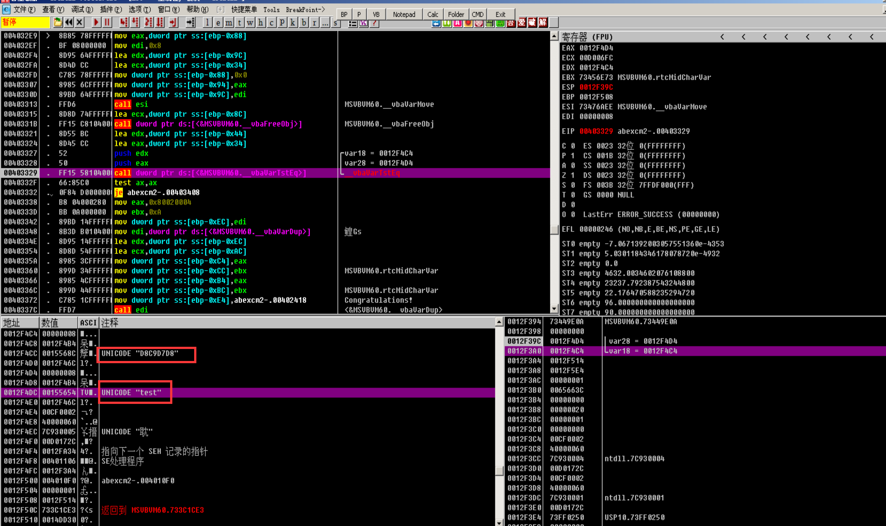

此处的 test 是我们手动输入的序列号，D8C9D7D8 是程序自身提供的序列号

保持用户名仍然是 test，输入程序提供的序列号，提醒我们的输入是正确的

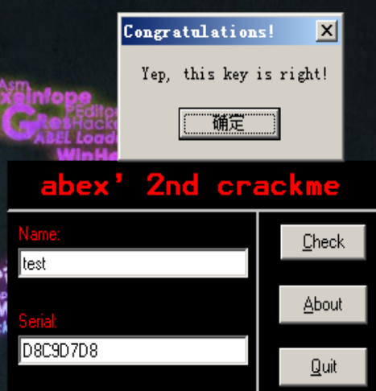

当我们修改用户名后，发现提醒验证码错误，这表明序列号和用户名是相关的

### 分析序列号生成代码

由于没有在程序的字符串中看到类似序列号的字符串，我们可以假定的是，程序是在我们单机 Check 按钮后生成的。我们之前利用字符串跳转的位置，是 Check 触发后执行的函数。可以先找当前函数最开始的部分，从那里开始分析

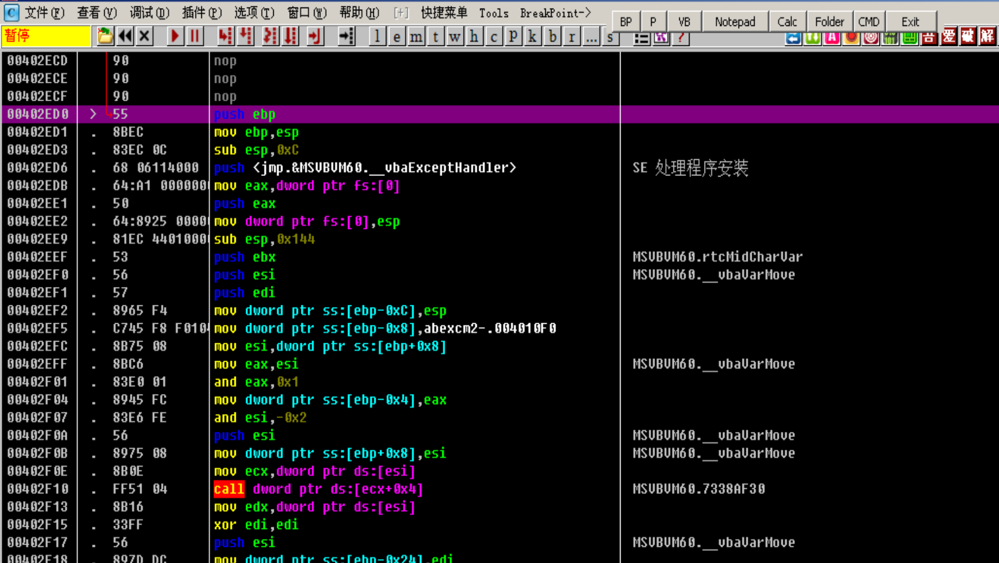

> 由于序列号和用户名是相关的，所以我们可以猜测，程序中会有读取用户名的相关 API，如 GetWindowText、GetDlgItemText 等，序列号的计算可能会涉及到循环、加密（XOR、ADD、SUB）等操作

单步步过，寻找读取用户名的代码
0x402f8e 处，函数局部对象 ss:[ebp - 0x88] 地址传递给了 EDX，并 push 进栈中作为 ds:[ecx+0xa0] 的参数
ds:[ecx+0xa0] 执行过后，ss:[ebp - 0x88] 显示了用户输入的 Name

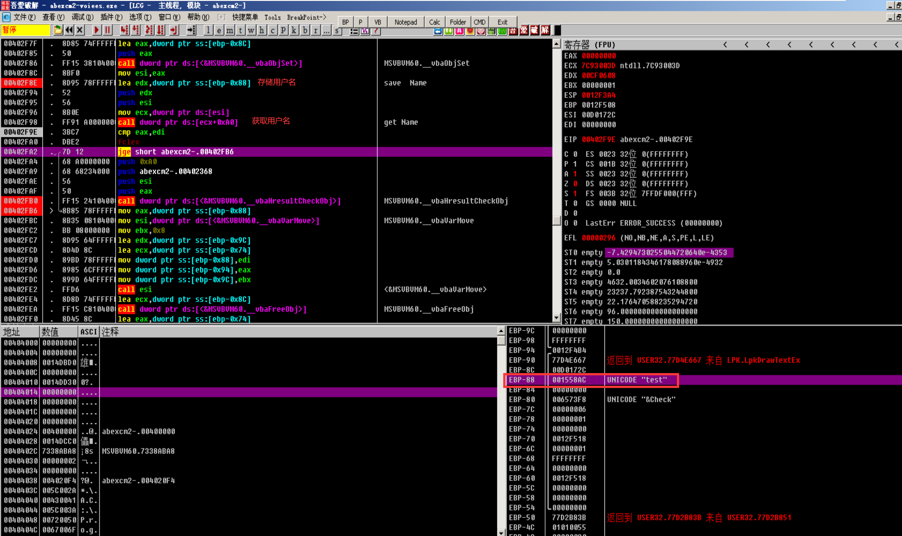

继续向下调试，发现会对用户名的长度进行判断，如果用户名小于 4 会有报错，

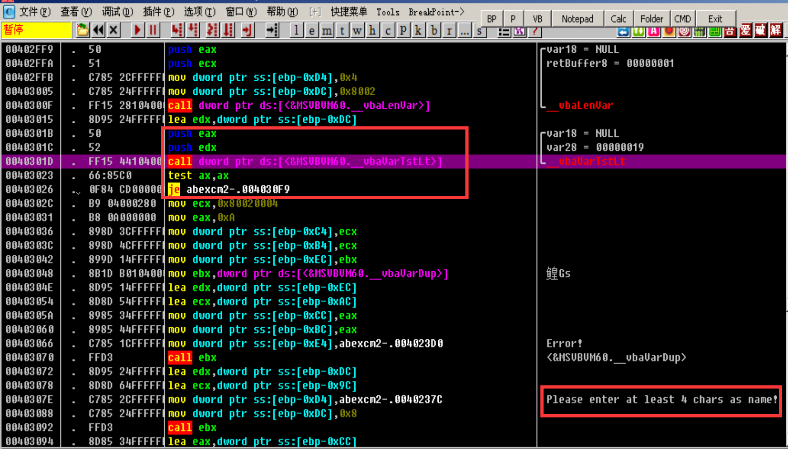

继续调试，在 0x403197 - 0x4032a5 处发现一个循环

``` x86asm
00403197    > /85C0          test eax,eax
00403199    . |0F84 06010000 je abexcm2-.004032A5
0040319F    . |8D95 64FFFFFF lea edx,dword ptr ss:[ebp-0x9C]
004031A5    . |8D45 DC       lea eax,dword ptr ss:[ebp-0x24]
004031A8    . |52            push edx
004031A9    . |50            push eax
004031AA    . |C785 6CFFFFFF>mov dword ptr ss:[ebp-0x94],0x1
004031B4    . |89BD 64FFFFFF mov dword ptr ss:[ebp-0x9C],edi
004031BA    . |FF15 A8104000 call dword ptr ds:[<&MSVBVM60.__vbaI4Var>]                    ;  MSVBVM60.__vbaI4Var
004031C0    . |8D4D 8C       lea ecx,dword ptr ss:[ebp-0x74]
004031C3    . |50            push eax
004031C4    . |8D95 54FFFFFF lea edx,dword ptr ss:[ebp-0xAC]
004031CA    . |51            push ecx
004031CB    . |52            push edx
004031CC    . |FFD3          call ebx
004031CE    . |8D95 54FFFFFF lea edx,dword ptr ss:[ebp-0xAC]
004031D4    . |8D4D AC       lea ecx,dword ptr ss:[ebp-0x54]
004031D7    . |FFD6          call esi                                                      ;  MSVBVM60.__vbaVarMove
004031D9    . |8D8D 64FFFFFF lea ecx,dword ptr ss:[ebp-0x9C]
004031DF    . |FF15 0C104000 call dword ptr ds:[<&MSVBVM60.__vbaFreeVar>]                  ;  MSVBVM60.__vbaFreeVar
004031E5    . |8D45 AC       lea eax,dword ptr ss:[ebp-0x54]
004031E8    . |8D8D 78FFFFFF lea ecx,dword ptr ss:[ebp-0x88]
004031EE    . |50            push eax                                                      ; /String8 = 00000001
004031EF    . |51            push ecx                                                      ; |ARG2 = 00000001
004031F0    . |FF15 80104000 call dword ptr ds:[<&MSVBVM60.__vbaStrVarVal>]                ; \__vbaStrVarVal  从 Name 中获取一个字符 UNICODE
004031F6    . |50            push eax                                                      ; /String = "t"
004031F7    . |FF15 1C104000 call dword ptr ds:[<&MSVBVM60.#516_rtcAnsiValueBstr>]         ; \rtcAnsiValueBstr   Unicode 转换为 ASCII
; 't' = 74
004031FD    . |8D95 24FFFFFF lea edx,dword ptr ss:[ebp-0xDC]
00403203    . |8D4D AC       lea ecx,dword ptr ss:[ebp-0x54]
00403206    . |66:8985 2CFFF>mov word ptr ss:[ebp-0xD4],ax
0040320D    . |89BD 24FFFFFF mov dword ptr ss:[ebp-0xDC],edi
00403213    . |FFD6          call esi                                                      ;  MSVBVM60.__vbaVarMove
00403215    . |8D8D 78FFFFFF lea ecx,dword ptr ss:[ebp-0x88]
0040321B    . |FF15 CC104000 call dword ptr ds:[<&MSVBVM60.__vbaFreeStr>]                  ;  MSVBVM60.__vbaFreeStr
00403221    . |8D55 AC       lea edx,dword ptr ss:[ebp-0x54]
00403224    . |8D85 24FFFFFF lea eax,dword ptr ss:[ebp-0xDC]
0040322A    . |52            push edx                                                      ; /var18 = 00000019
0040322B    . |8D8D 64FFFFFF lea ecx,dword ptr ss:[ebp-0x9C]                               ; |
00403231    . |50            push eax                                                      ; |var28 = 00000001
00403232    . |51            push ecx                                                      ; |saveto8 = 00000001
00403233    . |C785 2CFFFFFF>mov dword ptr ss:[ebp-0xD4],0x64                              ; |
0040323D    . |89BD 24FFFFFF mov dword ptr ss:[ebp-0xDC],edi                               ; |
00403243    . |FF15 AC104000 call dword ptr ds:[<&MSVBVM60.__vbaVarAdd>]                   ; \__vbaVarAdd
                                                                                           ; 74 + 64 = D8
00403249    . |8BD0          mov edx,eax
0040324B    . |8D4D AC       lea ecx,dword ptr ss:[ebp-0x54]
0040324E    . |FFD6          call esi                                                      ;  MSVBVM60.__vbaVarMove
00403250    . |8D55 AC       lea edx,dword ptr ss:[ebp-0x54]
00403253    . |8D85 64FFFFFF lea eax,dword ptr ss:[ebp-0x9C]
00403259    . |52            push edx
0040325A    . |50            push eax
0040325B    . |FF15 94104000 call dword ptr ds:[<&MSVBVM60.#573_rtcHexVarFromVar>]         ;  MSVBVM60.rtcHexVarFromVar  
                                                                                           ; 将数字 D8 转换为 Unicode "D8"
00403261    . |8D95 64FFFFFF lea edx,dword ptr ss:[ebp-0x9C]
00403267    . |8D4D AC       lea ecx,dword ptr ss:[ebp-0x54]
0040326A    . |FFD6          call esi                                                      ;  MSVBVM60.__vbaVarMove
0040326C    . |8D4D BC       lea ecx,dword ptr ss:[ebp-0x44]
0040326F    . |8D55 AC       lea edx,dword ptr ss:[ebp-0x54]
00403272    . |51            push ecx                                                      ; old
00403273    . |8D85 64FFFFFF lea eax,dword ptr ss:[ebp-0x9C]
00403279    . |52            push edx                                                      ; add
0040327A    . |50            push eax
0040327B    . |FF15 84104000 call dword ptr ds:[<&MSVBVM60.__vbaVarCat>]                   ;  MSVBVM60.__vbaVarCat
                                                                                           ; 连接字符串
                                                                                           ; serial(EAX) = old(ECX) + add(EDX)
00403281    . |8BD0          mov edx,eax
00403283    . |8D4D BC       lea ecx,dword ptr ss:[ebp-0x44]
00403286    . |FFD6          call esi                                                      ;  MSVBVM60.__vbaVarMove
00403288    . |8D8D BCFEFFFF lea ecx,dword ptr ss:[ebp-0x144]
0040328E    . |8D95 CCFEFFFF lea edx,dword ptr ss:[ebp-0x134]
00403294    . |51            push ecx                                                      ; /TMPend8 = 00000001
00403295    . |8D45 DC       lea eax,dword ptr ss:[ebp-0x24]                               ; |
00403298    . |52            push edx                                                      ; |TMPstep8 = 00000019
00403299    . |50            push eax                                                      ; |Counter8 = 00000001
0040329A    . |FF15 C0104000 call dword ptr ds:[<&MSVBVM60.__vbaVarForNext>]               ; \__vbaVarForNext
004032A0    .^\E9 F2FEFFFF   jmp abexcm2-.00403197
004032A5    >  8B45 08       mov eax,dword ptr ss:[ebp+0x8]
```

最后执行循环，生成下列序列号：serial = old("D8C9D7") + add("D8") = D8C9D7D8

尝试换了更长的用户名，该加密算法只循环了四次，即对用户名的前四个字母加密

算法流程如下：

1. 从给定的 Name 字符串前端逐一读取字符，读取前四个
2. 将字符转换为 ASCII 代码
3. ASCII 代码加 64
4. 将和转换为字符
5. 连接变换后的字符

## 未解决的问题

循环次数是自己试出来的，没有找到代码定义的部分
下面是书上上定义循环次数的地方，不理解为什么用 ebx 存储循环次数
希望后面的学习可以帮助解答这个疑惑

``` x86asm
00403102             .  BB 04000000   mov ebx,0x4
00403107             .  52            push edx                                                      ; /var18 = 0012F494
00403108             .  50            push eax                                                      ; |retBuffer8 = 0012F46C
```
