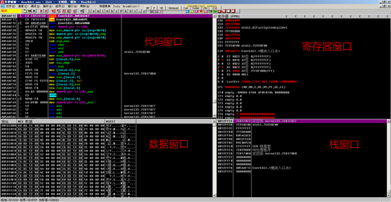
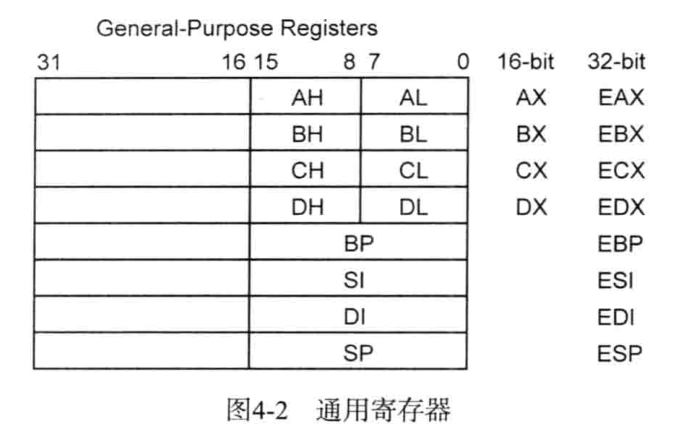
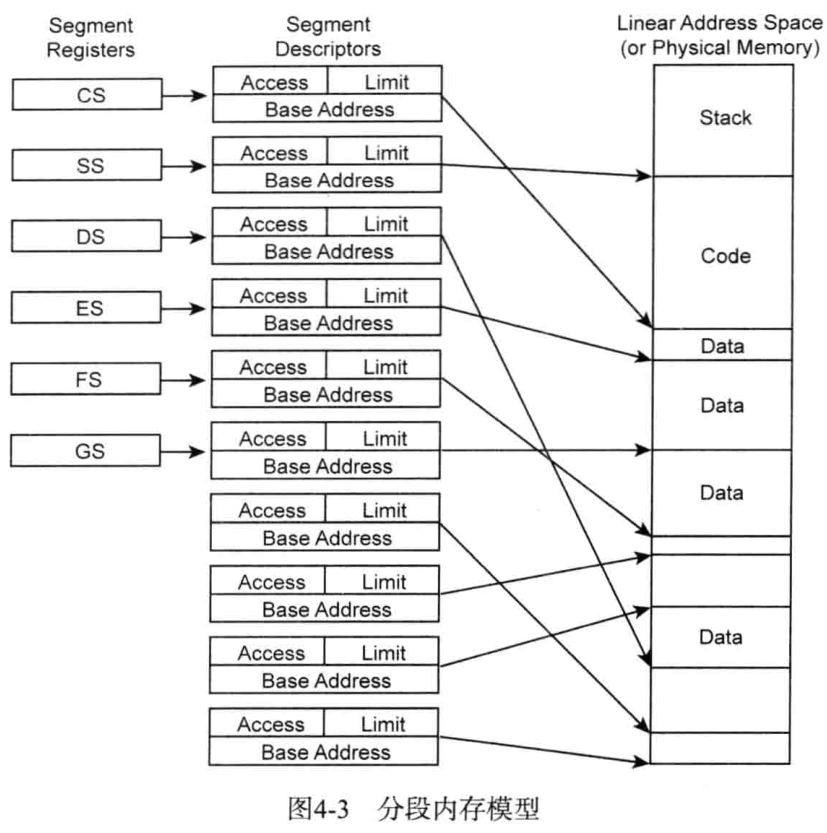

# 常识

## 术语

术语 | 解释
---|---
VA(virual Address) | 进程的虚拟地址
OP code(OPeration code) | CPU 指令(字节码 byte code)
PE(Portable Executable) | Windows 可执行文件(EXE、DLL、SYS 等)

## 分析方法

* 静态分析法：在不执行代码文件的情形下，对代码进行静态分析。
  * 常见特征
    * 文件类型
    * 文件大小
    * PE 头信息
    * Import/Export API
    * 内部字符串
    * 是否运行时解压缩
    * 注册信息
    * 调试信息
    * 数字证书
    * 内部代码、代码结构
* 动态分析法：在程序文件的执行过程中对代码进行动态分析。
  * 分析重点
    * 文件
    * 注册表
    * 网络
    * 内部结构
    * 动作原理

## OllyDbg

### 窗口

1. 代码窗口：默认显示反汇编代码，还可用于显示注释、标签，分析代码时显示循环、跳转位置等信息
2. 寄存器窗口：实时显示 CPU 寄存器的值，可用于修改特定的寄存器
3. 数据窗口：以 Hex/ASCII/Unicode 值的形式显示进程的内存地址，可在此修改内存地址
4. 栈窗口：实时显示 ESP 寄存器指向的进程栈内存，并允许修改

### 常用指令

指令 | 快捷键
------- | -------
重新开始调试 | Ctrl+F2
单步步入 | F7
单步步过 | F8
运行到返回 | Ctrl+F9
移动到指定地址 | Ctrl+G
执行到光标位置 | F4
添加注释 | ;
添加标签 | :
设置断点 | F2
运行 | F9
高亮当前 EIP 地址 | *
显示上一个光标未知 | -
查看 CALL/JMP 指令的相关地址 | Enter
编辑数据 | Ctrl+E
编写汇编代码 | 空格
创建修改副本 | 右键 -> 复制到可执行文件
查看栈窗口相对于 EBP 的距离 | 右键 -> 地址 -> 相对于 EBP

### 快速跳转重要代码

1. Goto 命令：Ctrl+G 后输入地址，光标移动到地址处，输入 F4，程序运行到光标处
2. 设置断点：F2 设置断点， ALT+B 可以查看全部断点
3. 使用注释：; 添加注释，右键查找 -> 用户定义的注释进行选择、跳转
4. 使用标签：: 添加标签，右键查找 -> 用户定义的标签进行选择、跳转

### 快速查找指定代码

1. 代码执行：逐条执行指令查找需要代码的位置。适用于功能明确（如弹窗），代码量不大的程序。
2. 字符串检索：右键 -> 搜索 -> 所有参考文本字串，也可使用插件。
3. API 检索：右键 -> 查找 -> 所有模块间的调用
4. API 检索：右键 -> 查找 -> 所有模块中的名称
5. 若软件被加壳，则可以在导入的 DLL 处设置断点

### 打补丁

* 修改字符串
  1. 直接修改字符串缓冲区
     * 找到要修改的缓冲区地址，在数据窗口选中，Ctrl+E 修改
     * 当修改的长度大于原有的长度时，可能会损坏后面的数据
  2. 在其他内存区域生成新字符串并传递给消息函数
     * 其他区域需要可写，修改的位置需要对齐偏移

* 保存更改
  * 选中更改区域，右键 -> 复制到可执行文件(一次只复制一个窗口的修改) -> 右键 -> 保存文件

## 字节序

大端字节序：内存地址低位存储数据的高位，常用于网络协议、大型 UNIX 服务器的 RISC 系列的 CPU 中
小端字节序：内存地址高位存储数据的高位，Intel x86 CPU，使用这种逆序方式存储数据，在进行算术运算和扩展/缩小数据时，效率较高
数据为单一字节时，无论大端序还是小端序，字节存储顺序都一样
字符串被保存在一个字符数组中时，由于字符数组在内存中是连续的，此时向字符数组存放数据，无论采用大端序还是小端序，存储顺序都相同

## IA-32 寄存器

### 通用寄存器

用于传送和暂存数据，也可参与算术逻辑运算，并保存运算结果。
IA-32 中每个通用寄存器的大小为 32 位，即 4 个字节，主要用来保存常量与地址等。

* EAX：累加器，针对操作数和结果数据，存储函数返回值
* EBX：基址寄存器，DS 段中的数据指针
* ECX：计数器，字符串和循环次操作
* EDX：数据寄存器，I/O 指针
* ESI：源变址寄存器，字符串操作源指针
* EDI：目标变址寄存器，字符串操作目标指针
* EBP：扩展基址指针寄存器，SS 段中栈内数据指针，栈基地址
* ESP：栈指针寄存器，SS 段中栈指针，栈顶地址

为了实现对低 16 位兼容，各寄存器又可分为高、低几个独立寄存器，以 EAX 为例，EAX 是 32 位寄存器，AX 是 EAX 的低 16 位， AH 是 AX 的高 8 位，AL是 AX 的低 8 位

### 段寄存器

段是一种内存保护技术，它把内存分为多个区段，并为每个区段赋予起始地址、范围、访问权限等，以保护内存。
段与分页技术(Paging)一起用于将虚拟内存变更为物理内存。每个段寄存器指向段描述符(Segment Descriptor)与虚拟内存结合，形成一个线性地址(Linear Address)，借助分页技术，线性地址最终呗转换位实际的物理地址(Physical Address)
段内存记录在 SDT(Segment Descriptor Table, 段描述符表) 中，而段寄存器就持有这些 SDT 的索引(index)
每个寄存器的大小为 16 位

* CS：Code Segment，代码段寄存器，存放应用程序代码所在段的段基址
* SS：Stack Segment，栈段寄存器，存放栈段的段基址
* DS：Data Segment，数据段寄存器，存放数据段的段基址
* ES：Extra (Data) Segment, 附加(数据)段寄存器，和后面的 FS、GS 寄存器用来存放程序使用的附加数据段的段基址
* FS：Dat Segment，数据段寄存器，可用于计算 SEH(Structured Exception Handler，结构化异常处理机制)、TEB(Thread Environment Block，线程环境快)、PEB(Process Environment Block，进程环境块)等地址
* GS：Data Segment，数据段寄存器

### 程序状态与控制寄存器

大小为 32 位，由原来 16 位的 FLAGS 寄存器扩展而来
其中和程序调试相关的标志有三个，分别为 ZF(Zero Flag，零标志)、 OF(Overflow Flag，溢出标志)、 CF(Carray Flag，进位标志)
在某些汇编指令，如 jcc(条件跳转)指令要检查这三个值

* EFLAGS：Flag Register，标志寄存器

### 指令指针寄存器

32 位，有原 16 位 IP 寄存器扩展而来
存储下一条要执行的指令地址，自增时增加的大小是指令的字节大小
与通用寄存器不同，我们不能直接修改 EIP 的值，只能通过其他指令(JMP、Jcc、CALL、RET)间接修改或者通过中断、异常来修改。

* EIP：Instruction Pointer，指令指针寄存器

## 栈

用途：存储局部变量、传递函数参数、保存函数返回地址等
先进后出(FILO，First In Last Out)原则存储数据
由高地址向低地址扩展

栈帧就是利用 EBP（栈帧指针）寄存器访问栈内局部变量、参数、函数返回地址等的手段。
