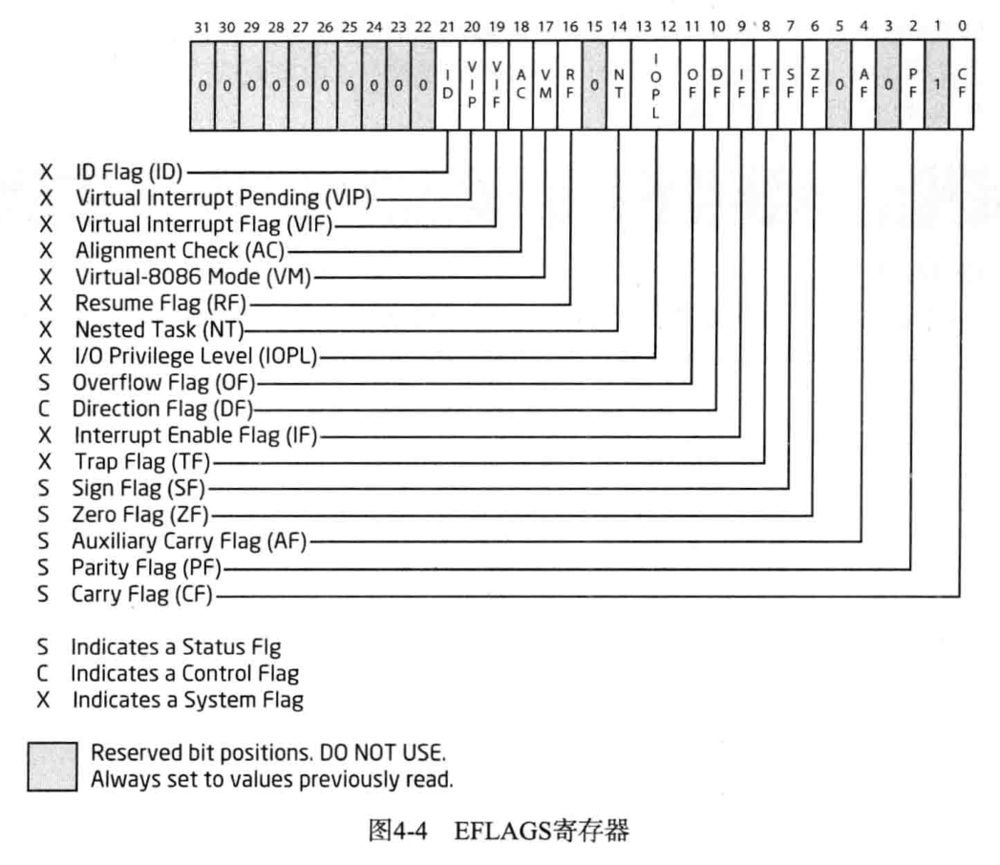

# 常识

## 术语

术语 | 解释
---|---
VA(virual Address) | 进程的虚拟地址
OP code(OPeration code) | CPU 指令(字节码 byte code)
PE(Portable Executable) | Windows 可执行文件(EXE、DLL、SYS 等)

## 分析方法

* 静态分析法：在不执行代码文件的情形下，对代码进行静态分析。
  * 常见特征
    * 文件类型
    * 文件大小
    * PE 头信息
    * Import/Export API
    * 内部字符串
    * 是否运行时解压缩
    * 注册信息
    * 调试信息
    * 数字证书
    * 内部代码、代码结构
* 动态分析法：在程序文件的执行过程中对代码进行动态分析。
  * 分析重点
    * 文件
    * 注册表
    * 网络
    * 内部结构
    * 动作原理

## OllyDbg

### 窗口


1. 代码窗口：默认显示反汇编代码，还可用于显示注释、标签，分析代码时显示循环、跳转位置等信息
2. 寄存器窗口：实时显示 CPU 寄存器的值，可用于修改特定的寄存器
3. 数据窗口：以 Hex/ASCII/Unicode 值的形式显示进程的内存地址，可在此修改内存地址
4. 栈窗口：实时显示 ESP 寄存器指向的进程栈内存，并允许修改

### 常用指令

指令 | 快捷键
------- | -------
重新开始调试 | Ctrl+F2
单步步入 | F7
单步步过 | F8
运行到返回 | Ctrl+F9
移动到指定地址 | Ctrl+G
执行到光标位置 | F4
添加注释 | ;
添加标签 | :
设置断点 | F2
运行 | F9
高亮当前 EIP 地址 | *
显示上一个光标未知 | -
查看 CALL/JMP 指令的相关地址 | Enter
编辑数据 | Ctrl+E
编写汇编代码 | 空格
创建修改副本 | 右键 -> 复制到可执行文件
查看栈窗口相对于 EBP 的距离 | 右键 -> 地址 -> 相对于 EBP

### 快速跳转重要代码

1. Goto 命令：Ctrl+G 后输入地址，光标移动到地址处，输入 F4，程序运行到光标处
2. 设置断点：F2 设置断点， ALT+B 可以查看全部断点
3. 使用注释：; 添加注释，右键查找 -> 用户定义的注释进行选择、跳转
4. 使用标签：: 添加标签，右键查找 -> 用户定义的标签进行选择、跳转

### 快速查找指定代码

1. 代码执行：逐条执行指令查找需要代码的位置。适用于功能明确（如弹窗），代码量不大的程序。
2. 字符串检索：右键 -> 搜索 -> 所有参考文本字串，也可使用插件。
3. API 检索：右键 -> 查找 -> 所有模块间的调用
4. API 检索：右键 -> 查找 -> 所有模块中的名称
5. 若软件被加壳，则可以在导入的 DLL 处设置断点

### 打补丁

* 修改字符串
  1. 直接修改字符串缓冲区
     * 找到要修改的缓冲区地址，在数据窗口选中，Ctrl+E 修改
     * 当修改的长度大于原有的长度时，可能会损坏后面的数据
  2. 在其他内存区域生成新字符串并传递给消息函数
     * 其他区域需要可写，修改的位置需要对齐偏移

* 保存更改
  * 选中更改区域，右键 -> 复制到可执行文件(一次只复制一个窗口的修改) -> 右键 -> 保存文件

## 字节序

大端字节序：内存地址低位存储数据的高位，常用于网络协议、大型 UNIX 服务器的 RISC 系列的 CPU 中
小端字节序：内存地址高位存储数据的高位，Intel x86 CPU，使用这种逆序方式存储数据，在进行算术运算和扩展/缩小数据时，效率较高
数据为单一字节时，无论大端序还是小端序，字节存储顺序都一样
字符串被保存在一个字符数组中时，由于字符数组在内存中是连续的，此时向字符数组存放数据，无论采用大端序还是小端序，存储顺序都相同

## IA-32 寄存器

### 通用寄存器

用于传送和暂存数据，也可参与算术逻辑运算，并保存运算结果。
IA-32 中每个通用寄存器的大小为 32 位，即 4 个字节，主要用来保存常量与地址等。

* EAX：累加器，针对操作数和结果数据，存储函数返回值
* EBX：基址寄存器，DS 段中的数据指针
* ECX：计数器，字符串和循环次操作
* EDX：数据寄存器，I/O 指针
* ESI：源变址寄存器，字符串操作源指针
* EDI：目标变址寄存器，字符串操作目标指针
* EBP：扩展基址指针寄存器，SS 段中栈内数据指针，栈基地址
* ESP：栈指针寄存器，SS 段中栈指针，栈顶地址


为了实现对低 16 位兼容，各寄存器又可分为高、低几个独立寄存器，以 EAX 为例，EAX 是 32 位寄存器，AX 是 EAX 的低 16 位， AH 是 AX 的高 8 位，AL是 AX 的低 8 位

### 段寄存器

段是一种内存保护技术，它把内存分为多个区段，并为每个区段赋予起始地址、范围、访问权限等，以保护内存。
段与分页技术(Paging)一起用于将虚拟内存变更为物理内存。每个段寄存器指向段描述符(Segment Descriptor)与虚拟内存结合，形成一个线性地址(Linear Address)，借助分页技术，线性地址最终呗转换位实际的物理地址(Physical Address)
段内存记录在 SDT(Segment Descriptor Table， 段描述符表) 中，而段寄存器就持有这些 SDT 的索引(index)
每个寄存器的大小为 16 位

* CS：Code Segment，代码段寄存器，存放应用程序代码所在段的段基址
* SS：Stack Segment，栈段寄存器，存放栈段的段基址
* DS：Data Segment，数据段寄存器，存放数据段的段基址
* ES：Extra (Data) Segment， 附加(数据)段寄存器，和后面的 FS、GS 寄存器用来存放程序使用的附加数据段的段基址
* FS：Data Segment，数据段寄存器，可用于计算 SEH(Structured Exception Handler，结构化异常处理机制)、TEB(Thread Environment Block，线程环境快)、PEB(Process Environment Block，进程环境块)等地址
* GS：Data Segment，数据段寄存器


### 程序状态与控制寄存器

大小为 32 位，由原来 16 位的 FLAGS 寄存器扩展而来
其中和程序调试相关的标志有三个，分别为 ZF(Zero Flag，零标志)、 OF(Overflow Flag，溢出标志)、 CF(Carray Flag，进位标志)
在某些汇编指令，如 jcc(条件跳转)指令要检查这三个值

* EFLAGS：Flag Register，标志寄存器



### 指令指针寄存器

32 位，有原 16 位 IP 寄存器扩展而来
存储下一条要执行的指令地址，自增时增加的大小是指令的字节大小
与通用寄存器不同，我们不能直接修改 EIP 的值，只能通过其他指令(JMP、Jcc、CALL、RET)间接修改或者通过中断、异常来修改。

* EIP：Instruction Pointer，指令指针寄存器

## 栈

用途：存储局 部变量、传递函数参数、保存函数返回地址等
先进后出(FILO，First In Last Out)原则存储数据
由高地址向低地址扩展

栈帧就是利用 EBP（栈帧指针）寄存器访问栈内局部变量、参数、函数返回地址等的手段。

## 函数调用约定

函数调用约定是对函数调用时如何传递参数的一种约定。
常见函数调用约定：cdecl、stdcall、fastcall

### cdecl

C 语言主要使用的调用方式，调用者（调用函数的一方）负责处理栈
cdecl 的好处是可以向被调用参数传递变长的参数

``` x86asm
00401000  /$  55            push ebp                                 ; add()
00401001  |.  8BEC          mov ebp，esp
00401003  |.  8B45 08       mov eax，[arg.1]                          ;  cdecl.<模块入口点>
00401006  |.  0345 0C       add eax，[arg.2]
00401009  |.  5D            pop ebp                                  ;  cdecl.00409330
0040100A  \.  C3            retn
0040100B      CC            int3
0040100C      CC            int3
0040100D      CC            int3
0040100E      CC            int3
0040100F      CC            int3
; add(1， 2)
00401010  /$  55            push ebp                                  ; main()
00401011  |.  8BEC          mov ebp，esp
00401013  |.  6A 02         push 0x2
00401015  |.  6A 01         push 0x1
00401017  |.  E8 E4FFFFFF   call cdecl.00401000
0040101C  |.  83C4 08       add esp，0x8
0040101F  |.  5D            pop ebp                                  ;  cdecl.00409330
00401020  \.  C3            retn
```

### stdcall

常用于 Win32 API，被调用者清理栈
下面汇编代码可以看出，栈清理工作由 add() 函数中最后（0040100A）的 retn 0x8 命令执行
retn 0x8 == retn + pop 8 字节即返回后使 ESP 增加指定大小。此处 esp + 8
stdcall 的好处是代码量较小，不用每次调用函数都使用 `ADD EXP， XXX` 来清理栈

``` x86asm
00401000  /$  55            push ebp                                  ; add()
00401001  |.  8BEC          mov ebp，esp
00401003  |.  8B45 08       mov eax，[arg.1]                          ;  stdcall.<模块入口点>
00401006  |.  0345 0C       add eax，[arg.2]
00401009  |.  5D            pop ebp                                  ;  kernel32.7C817077
0040100A  \.  C2 0800       retn 0x8
0040100D      CC            int3
0040100E      CC            int3
0040100F      CC            int3
; add(1， 2)
00401010  /$  55            push ebp                                  ; main()
00401011  |.  8BEC          mov ebp，esp
00401013  |.  6A 02         push 0x2
00401015  |.  6A 01         push 0x1
00401017  |.  E8 E4FFFFFF   call stdcall.00401000
0040101C  |.  5D            pop ebp                                  ;  kernel32.7C817077
0040101D  \.  C3            retn
```

### fastcall

fastcall 与 stdcall 类似，但 fastcall 通常会使用寄存器 ECX、EDX 传递前两个参数
fast 的好处在于可以实现函数的快速调用（CPU 访问寄存器的速度要远比内存块的多），但有时需要额外的系统开销来管理 ECX、EDX 寄存器，如备份

## PE 文件格式

PE 文件时 Windows 操作系统下使用的可执行文件格式。它是微软在 UNIX 平台的 COFF（Common Object File Format，通用文件格式）基础上制作而成的。
PE 文件时指 32 位的可执行文件，也称为 PE32。64 位的可执行文件成为 PE+ 或 PE32+，是 PE（PE32）文件的一种扩展形式。

下面是 PE 文件种类

种类 | 主扩展名
---|-----
可执行系列 | EXE、SCR
驱动程序系列 | SYS、VXD
库系列 | DLL、OCX、CPL、DRV
对象文件系列 | OBJ


VA 指的是进程虚拟内存的绝对地址，RVA ( Relative Virtual Address，相对虚拟地址）指从某个基准位置( ImageBase）开始的相对地址。VA 与 RVA 满足下面的换算关系：RVA + ImageBase = VA
PE 头内部信息大多以 RVA 形式存在。原因在于，PE 文件（主要是 DLL)加载到进程虚拟内存的特定位置时，该位置可能已经加载了其他 PE 文件(DLL)。此时必须通过重定位(Relocation)将其加载到其他空白的位置，若 PE 头信息使用的是 VA，则无法正常访问。因此使用 RVA 来定位信息，即使发生了重定位，只要相对于基准位置的相对地址没有变化，就能正常访问到指定信息，不会出现任何问题。
> 32 位 Windows OS 中，各进程分配有 4GB 的虚拟内存，因此进程中 VA 值的亿固定 00000000~FFFFFFFF。

### DOS 头


``` c
// 注释掉的不需要重点分析
struct _IMAGE_DOS_HEADER{
    0X00 WORD e_magic;      // Magic DOS signature MZ(4D 5A): MZ 标记：用于标记是否是可执行文件
    // 0X02 WORD e_cblp;     // Bytes on last page of 
    // 0X04 WORD e_cp;       // Pages in filefile
    // 0X06 WORD e_crlc;     // Relocations
    // 0X08 WORD e_cparhdr;  // Size of header in paragraphs
    // 0X0A WORD e_minalloc; // Minimun extra paragraphs needs
    // 0X0C WORD e_maxalloc; // Maximun extra paragraphs needs
    // 0X0E WORD e_ss;       // intial(relative)SS value
    // 0X10 WORD e_sp;       // intial SP value
    // 0X12 WORD e_csum;     // Checksum
    // 0X14 WORD e_ip;       // intial IP value
    // 0X16 WORD e_cs;       // intial(relative)CS value
    // 0X18 WORD e_lfarlc;   // File Address of relocation table
    // 0X1A WORD e_ovno;     // Overlay number
    // 0x1C WORD e_res[4];   // Reserved words
    // 0x24 WORD e_oemid;    // OEM identifier(for e_oeminfo)
    // 0x26 WORD e_oeminfo;  // OEM information;e_oemid specific
    // 0x28 WORD e_res2[10]; // Reserved words
    0x3C DWORD e_lfanew;    // Offset to start of PE header：定位 PE 文件，PE 头（NT 头）相对于文件的偏移量
};
```

IMAGE_DOS_HEADER 结构体的大小为 40 个字节。该结构体中必须要知道的两个参数是 e_magic 和 e_lfanew。e_magic 是 DOS 签名（signatrue，4D 5A => ASCII 值 "MZ"），e_lfanew。e_magic 指示 NT（IMAGE_NT_HEADERS） 头的偏移（根据不同文件拥有可变值）

### DOS stub（存根）

DOS 存根(stub）在 DOS 头下方，是个可选项，且大小不固定（即使没有 DOS 存根，文件也能正常运行)。DOS 存根由代码与数据混合而成。


上图是 notepad.exe 的 DOS stub，文件偏移 40~4D 区域为 16 位的汇编指令。32 位的 Windows OS 中不会运行该命令(由于被识别为 PE 文件，所以完全忽视该代码)。在 DOS 环境中运行 Notepad.exe 文件，或者使用 DOS 调试器（debug.exe)运行它，可使其执行该代码（不认识 PE 文件格式，所以被识别为 DOS EXE 文件)。
打开命令行窗口（cmd.exe)，输入如下命令（仅适用于 Windows XP 环境)。`debug C:\Windows\notepad.exe`
在出现的光标位置上输入“u”指令(Unassemble)，将会出现 16 位的汇编指令，如下所示。


程序在画面中输出字符串 “This program cannot be run in DOS mode” 后就退出。
DOS 存根是可选项，开发工具应该支持它(VB、VC++、Delphi 等默认支持 DOS 存根)。

### NT 头

``` c
typedef struct _IMAGE_NT_HEADERS {
DWORD Signature;                                  //  PE Signaure:50450000 ("PE"00)
IMAGE_FILE_HEADER FileHeader;                      //  文件头
IMAGE_OPTIONAL_HEADER32 OptionalHeader;           //  可选头
} IMAGE_NT_HEADERS32, *PIMAGE_NT_HEADERS32;
```

#### NT 头：文件头

``` c
// 大小为: 0x14(20)字节
 
#define IMAGE_SIZEOF_FILE_HEADER             20
 
typedef struct _IMAGE_FILE_HEADER {
    WORD    Machine;                // 程序运行平台
    WORD    NumberOfSections;       // PE中节(IMAGE_SECTION_HEADER)的数量
    DWORD   TimeDateStamp;          // 时间戳，文件创建日期和时间
    DWORD   PointerToSymbolTable;   // COFF符号表的文件偏移.(用于调试)
    DWORD   NumberOfSymbols;        // 符号表中的符号数量(用于调试)
    WORD    SizeOfOptionalHeader;   // 扩展PE头(IMAGE_OPTIONAL_HEADER)大小
    WORD    Characteristics;        // PE文件属性
} IMAGE_FILE_HEADER, *PIMAGE_FILE_HEADER;
```

IMAGE_FILE_HEADER 中有如下四个重要成员：Machine、NumberOfSections、SizeOfOptionalHeader、Characteristics，若设置不正确，将导致文件无法正常运行

``` c
//  每个 CPU 都拥有唯一的 Machine 码，兼容 32 位 Intel x86 芯片的 Machine 码为 14C
#define IMAGE_FILE_MACHINE_UNKNOWN           0       //  适用于任何机器    
#define IMAGE_FILE_MACHINE_TARGET_HOST       0x0001  
#define IMAGE_FILE_MACHINE_I386              0x014c  //  intel386处理器或后续兼容处理器
#define IMAGE_FILE_MACHINE_R3000             0x0162  //  MIPS little-endian， 0x160 big-endian
#define IMAGE_FILE_MACHINE_R4000             0x0166  //  MIPS小尾处理器
#define IMAGE_FILE_MACHINE_R10000            0x0168  //  MIPS little-endian
#define IMAGE_FILE_MACHINE_WCEMIPSV2         0x0169  //  MIPS小尾WCEv2处理器
#define IMAGE_FILE_MACHINE_ALPHA             0x0184  //  Alpha_AXP
#define IMAGE_FILE_MACHINE_SH3               0x01a2  //  Hitachi SH3处理器
#define IMAGE_FILE_MACHINE_SH3DSP            0x01a3  //  Hitachi SH3 DSP处理器
#define IMAGE_FILE_MACHINE_SH3E              0x01a4  //  SH3E little-endian
#define IMAGE_FILE_MACHINE_SH4               0x01a6  //  Hitachi SH4处理器
#define IMAGE_FILE_MACHINE_SH5               0x01a8  //  Hitachi SH5处理器
#define IMAGE_FILE_MACHINE_ARM               0x01c0  //  ARM小尾处理器
#define IMAGE_FILE_MACHINE_THUMB             0x01c2  //  ARM或Thumb处理器
#define IMAGE_FILE_MACHINE_ARMNT             0x01c4  //  ARMv7(或更高)处理器的Thumb模式
#define IMAGE_FILE_MACHINE_AM33              0x01d3  //  MatsushitaAM33处理器
#define IMAGE_FILE_MACHINE_POWERPC           0x01F0  //  PowerPC小尾处理器
#define IMAGE_FILE_MACHINE_POWERPCFP         0x01f1  //  带浮点支持的PowerPC处理器
#define IMAGE_FILE_MACHINE_IA64              0x0200  //  Intel Itanium处理器系列
#define IMAGE_FILE_MACHINE_MIPS16            0x0266  //  MIPS16处理器
#define IMAGE_FILE_MACHINE_ALPHA64           0x0284  //  ALPHA64
#define IMAGE_FILE_MACHINE_MIPSFPU           0x0366  //  带FPU的MIPS处理器
#define IMAGE_FILE_MACHINE_MIPSFPU16         0x0466  //  带FPU的MIPS16处理器
#define IMAGE_FILE_MACHINE_AXP64             IMAGE_FILE_MACHINE_ALPHA64
#define IMAGE_FILE_MACHINE_TRICORE           0x0520  //  Infineon
#define IMAGE_FILE_MACHINE_CEF               0x0CEF
#define IMAGE_FILE_MACHINE_EBC               0x0EBC  //  EFI字节码处理器
#define IMAGE_FILE_MACHINE_AMD64             0x8664  //  x64处理器
#define IMAGE_FILE_MACHINE_M32R              0x9041  //  MatsushitaM32R小尾处理器
#define IMAGE_FILE_MACHINE_ARM64             0xAA64  //  ARM64 Little-Endian
#define IMAGE_FILE_MACHINE_CEE               0xC0EE
```

PE 文件把代码、数据、资源等依据属性分类到各节区中存储。
NumberOfSections 用来指出文件中存在的节区数量。该值一定要大于 0，且当定义的节区数量与实际节区不同时，将发生运行错误。

SizeOfOptionalHeader 指出 IMAGE_OPTIONAL_HEADER 结构体长度

借助 IMAGE_DOS_HEADER 的 e_lfanew 与 IMAGE_FILE_HEADER 的 SizeOfOptionalHeader 可以创建出一个脱离常规的 PE 文件（PE Patch）（也有人称为 “麻花” PE 文件）

Characteristics 用于标识文件的属性，文件是否是可运行的形态、是否为 DLL 文件等信息，以 bit OR 形式组合起来

数据位 | 常量符号 | 常量值 | 为 1 时的含义
----|------|-----|---------
0 | IMAGE_FILE_RELOCS_STRIPPED | 0x0001 | 文件中不存在重定位信息
1 | IMAGE_FILE_EXECUTABLE_IMAGE  | 0x0002 | 文件是可执行的
2 | IMAGE_FILE_LINE_NUMS_STRIPPED  | 0x0004 | 不存在行信息
3 | IMAGE_FILE_LOCAL_SYMS_STRIPPED | 0x0008 | 不存在符号信息
4 | IMAGE_FILE_AGGRESIVE_WS_TRIM | 0x0010 | 调整工作集 Agressively trim working set
5 | IMAGE_FILE_LARGE_ADDRESS_AWARE | 0x0020 | 应用程序可处理大于 2GB 的地址
6 |  此标志保留 
7 | IMAGE_FILE_BYTES_REVERSED_LO | 0x0080 | 小尾方式
8 | IMAGE_FILE_32BIT_MACHINE | 0x0100 | 在 32 位平台上运行
9 | IMAGE_FILE_DEBUG_STRIPPED  | 0x0200 | 不包含调试信息
10 | IMAGE_FILE_REMOVABLE_RUN_FROM_SWAP | 0x0400 | 不能从可移动盘运行
11 | IMAGE_FILE_NET_RUN_FROM_SWAP | 0x0800 | 不能从网络运行
12 | IMAGE_FILE_SYSTEM | 0x1000 | 系统文件(如驱动程序)，不能直接运行
13 | IMAGE_FILE_DLL | 0x2000 | 这是一个DLL文件
14 | IMAGE_FILE_UP_SYSTEM_ONL | Y | 0x4000 | 文件不能在多处理器的计算机上运行
15 | IMAGE_FILE_BYTES_REVERSED_HI | 0x8000 | 大尾方式

``` c
//  Characteristics
#define IMAGE_FILE_RELOCs STRIPPED     0x0001 //  Relocation info stripped from file.
#define IMAGE_FILE_EXECUTABLE_IMAGE    0x0002 //  File is executable
// (i.e. no unresolved externel references).
#define IMAGE_FILE_LINE_NUMS_STRIPPED  0x0004 //  Line numbers stripped from file.
#define IMAGE_FILE_LOCAL_SYMS_STRIPPED 0x0008 //  Local symbols stripped from file.
#define IMAGE_FILE_AGGRESIVE_WS_TRIM   0x0010 //  Agressively trim working set
#define IMAGEFILELARGE_ADDRESS_AwARE   0x0020 //  App can handle >2gb addresses
#define IMAGE_FILE_BYTES_REVERSED_LO   0x0080 //  byte of machine word are reversed .
#define IMAGE_FILE_32BIT_MACHINE       0x0100  // 32 bit word machine.
#define IMAGE_FILE_DEBUGSTRIPPED       0x0200 //  Debugging info stripped from
//  file in .DBG file
#define IMAGE_FILE_RENOVABLE_RUN_FROM_SWAP 0x0400 //  If Image is on removable media，
//  copy and run from the swap file.
#define IMAGE_FILE_NET_RUN_FROM_SWAP 	0x0800 // If Image is on Net，
// copy and run from the swap file.
#define IMAGE_FILE_SYSTEM 	 			 0x1000 //  System File.
#define IMAGE_FILE_DLL 					 0x2000 // File is a DLL.
#define IMAGE_FILE_UP_SYSTEM_ONLY     	 Ox4000 // File should only be run on a UP machine
#define IMAGE_FILE_BYTES_REVERSED_HI 	 0x8000 //  byte of machine word are reversed.
```

类似 *.obj 的 object 文件及 resource DLL 文件的 Characteristics 的值不是 0x0002（不可执行）

#### NT 头：可选头

IMAGE_ OPTIONAL_HEADER32 是 PE 头结构体中最大的。

``` c
typedef struct _IMAGE_DATA_DIRECTORY {
  DWORD VirtualAddress;
  DWORD Size;
} IMAGE_DATA_DIRECTORY, *PIMAGE_DATA_DIRECTORY;

# define IMAGE_NUMBEROF_DIRECTORY_ENTRIES 16

typedef struct _IMAGE_OPTIONAL_HEADER {
    
    // 
    //  Standard fields.
    // 
    WORD    Magic;    // 标志字
    BYTE    MajorLinkerVersion;   // 链接器主版本号
    BYTE    MinorLinkerVersion;   // 链接器次版本号
    DWORD   SizeOfCode;   // 所有含有代码的区块的大小
    DWORD   SizeOfInitializedData;    // 所有初始化数据区块的大小
    DWORD   SizeOfUninitializedData;    // 所有未初始化数据区块的大小
    DWORD   AddressOfEntryPoint;    // 程序执行入口 RVA
    DWORD   BaseOfCode;   // 代码区块起始 RVA
    DWORD   BaseOfData;   // 数据区块起始 RVA

    // 
    //  NT additional fields.
    // 
    DWORD   ImageBase;    // 程序默认载入基地址
    DWORD   SectionAlignment;   // 内存中区块的对齐值
    DWORD   FileAlignment;    // 文件中区块的对齐值
    WORD    MajorOperatingSystemVersion;    // 操作系统主版本号
    WORD    MinorOperatingSystemVersion;    // 操作系统次版本号
    WORD    MajorImageVersion;    // 用户自定义主版本号
    WORD    MinorImageVersion;    // 用户自定义次版本号
    WORD    MajorSubsystemVersion;    // 所需子系统主版本号
    WORD    MinorSubsystemVersion;    // 所需子系统次版本号
    DWORD   Win32VersionValue;    // 保留，通常被设置为0
    DWORD   SizeOfImage   ;// 映像载入内存后的总尺寸
    DWORD   SizeOfHeaders;    // MS-DOS头部、PE文件头、区块表总大小
    DWORD   CheckSum;   // 映像校验和
    WORD    Subsystem;    // 文件子系统
    WORD    DllCharacteristics;   // 显示 DLL 特性的标志
    DWORD   SizeOfStackReserve;   // 初始化时栈的大小
    DWORD   SizeOfStackCommit;    // 初始化时实际提交栈的大小
    DWORD   SizeOfHeapReserve;    // 初始化时保留堆的大小
    DWORD   SizeOfHeapCommit;   // 初始化时实际保留堆的大小
    DWORD   LoaderFlags;    // 与调试相关，默认值为0
    DWORD   NumberOfRvaAndSizes;    // 数据目录表的项数
IMAGE_DATA_DIRECTORY DataDirectory[IMAGE_NUMBEROF_DIRECTORY_ENTRIES];// 数据目录表

} IMAGE_OPTIONAL_HEADER32, *PIMAGE_OPTIONAL_HEADER32;
```

十个必须的项，如果设置错误将导致文件无法执行：Magic、AddressOfEntryPoint、ImageBase、SectionAlignment、FileAlignment、SizeOfImage、Subsystem、NumberOfRvaAndSizes和 DataDirectory

Magic 是 IMAGE_OPTIONAL_HEADER32 结构体时，Magic 码为 10B；是 IMAGE_OPTIONAL_HEADER64 结构体时，Magic 码为 20B

AddressOfEntryPoint 是程序入口（EP）的相对虚拟地址（RVA），指出程序最先执行的代码起始地址。

ImageBase 指出文件的优先装入地址。在 32 位系统中，进程虚拟内存的范围是 0~FFFFFFFF
EXE、DLL 文件被装载到用户内存的 0~7FFFFFFF 中，SYS 文件被载入内核内存的 80000000~FFFFFFFF 中。
通常情况下，使用开发工具创建好 EXE 文件后，其 ImageBase 的值位 00400000，DLL 文件的 ImageBase 值位 10000000.
执行 PE 文件时，PE 装载器先创建进程，再将文件载入内存，然后把 EIP 寄存器的值设置为 ImageBase+AddressOfEntryPoint

SectionAlignment 指定节区在内存中的最小单位，FileAlignment 指定了节区在磁盘文件中的最小单位。这二者的值可以相同也可以不同。内存或磁盘文件的节区大小必须是 SectionAlignment 或 FileAlignment 值的整数倍

SizeOfImage 指定了 PE Image 在虚拟内存中所占用空间的大。一般而言，文件的大小与加载到内存中的大小是不同的（节区头中定义了各节装载的位置与占有内存的大小）。

SizeOfHeader 指出整个 PE 头的大小。该值必须是 FileAlignment 的整数倍。第一节区所在位置与 SizeOfHeader 距文件开始偏移的量相同

Subsystem 用来区分系统驱动文件（*.sys）与普通的可执行文件（*.exe， *.dll）

值 | 含义 | 备注
--|----|---
1 | Driver 文件 | 系统驱动，如：ntfs.sys
2 | GUI 文件 | 窗口应用程序，如：notepad.exe
3 | CUI 文件 | 控制台应用程序，如：cmd.exe

NumberOfRvaAndSizes 指定 DataDirectory（IMAGE_OPTIONAL_HEADer32 结构体的最后一个成员）数组的个数。虽然结构体中明确了数组个数为 16 `# define IMAGE_NUMBEROF_DIRECTORY_ENTRIES 16`，但是 PE 装载器通过查看 NumberOfRvaAndSizes 值来识别数组大小，可以不是 16

DataDirectory 是由 IMAGE_DATA_DIRECTORY 结构体组成的数组，数组的每项都有被定义的值。EXPORT Directory、IMPORT Directory、TLS Directory 需重点关注

``` text
DataDirectory[0] = EXPORT Directory 
DataDirectory[1] = IMPORT Directory
DataDirectory[2] = RESOURCE Directory
DataDirectory[3] = EXCEPTION Directory
DataDirectory[4] = SECURITY Di rectory
DataDirectory[5] = BASERELOC Directory
DataDirectory[6] = DEBUG Directory
DataDirectory[7] = COPYRIGHT Directory
DataDi rectory[8] = GLOBALPTR Directory
DataDirectory[9] = TLS Directory
DataDirectory[A] = LOAD CONFIG Directory
DataDirectory[B] = BOUND IMPORT Directory
DataDirectory[C] = IAT Directory
DataDirectory[D] = DELAY IMPORT Directory
DataDirectory[E] = COM DESCRIPTOR Directory
DataDirectory[F] = Reserved Directory
```

### 节区头

``` c
typedef struct _IMAGE_SECTION_HEADER {
    
    BYTE    Name[IMAGE_SIZEOF_SHORT_NAME];    // 8字节的块名区块尺寸
    union {
    
            DWORD   PhysicalAddress;
            DWORD   VirtualSize;  // * 内存中节区所占大小
    } Misc;
    DWORD   VirtualAddress;   // * 内存中节区起始地址 RVA
    DWORD   SizeOfRawData;    // * 磁盘文件中节区所占大小
    DWORD   PointerToRawData;   // * 磁盘文件中节区起始位置
    DWORD   PointerToRelocations;   // 在 OBJ 文件中使用，重定位的偏移
    DWORD   PointerToLinenumbers;   // 行号表的偏移(供调试用)
    WORD    NumberOfRelocations;    // 在 OBJ 文件中使用，重定位项数目
    WORD    NumberOfLinenumbers;    // 行号表中行号的数目
    DWORD   Characteristics;    // * 节区属性
} IMAGE_SECTION_HEADER, *PIMAGE_SECTION_HEADER;

#define IMAGE_SIZEOF_SHORT_NAME              8
#define IMAGE_SIZEOF_SECTION_HEADER          40   // 区块表的长度为40个字节
```

重点字段：VirtualSize、VirtualAddress、SizeOfRawData、PointerToRawData、Characteristics

VirtualAddress 与 PointerToRawData 不带有任何值，分别由定义在 IMAGE _OPTIONAL_HEADER32 中的SectionAlignment 与 FileAlignment 确定。

 VirtualSize 与 SizeOfRawData 一般具有不同的值，即磁盘文件中节区的大小与加载到内存中的节区大小是不同的

Characterisitics 由下面代码段中显示的值组合(bit OR)而成。

``` c
// Characterisitics
#define IMAGE_SCN_CNT_CODE 0x00000020 // Section contains code.
#define IMAGE_SCN_CNT_INITIALIZED DATA   0x00000040 // Section contains initialized data.
#define IMAGE_SCN_CNT_UNINITIALIZED DATA 0x00000080 // Section contains uninitialized data.
#define IMAGE_SCN_MEM_EXECUTE    0x20000000 // Section is executable.
#define IMAGE_SCN_MEM_READ       0x40000000 // Section is readable.
#define IMAGE_SCN_MEM_WRITE    	  0x80000000 // Section is writable.
``` 

Name 成员不像 C 语言中的字符串一样以 NULL 结束，并且没有“必须使用 ASCII 值”的限制。PE 规范未明确规定节区的 Name，所以可以向其中放入任何值，甚至可以填充 NULL 值。所以节区的 Name 仅供参考，不能保证其百分之百地被用作某种信息(数据节区的名称也可叫做 .code)。

> 讲解 PE 文件时经常出现“映像”(Image)这一术语。PE 文件加载到内存时，文件不会原封不动地加载，而要根据节区头中定义的节区起始地址、节区大小等加载。因此，磁盘文件中的 PE 与内存中的 PE 具有不同形态。将装载到内存中的形态称为“映像”以示区别，使用这一术语能够很好地区分二者。

### RVA to RAW

RVA 内存中的地址，RAW 磁盘中的地址
PE 文件加载到内存时，每个节区都要能准确完成内存地址与文件偏移间的映射。这种映射一般称为 RVA to RAW，方法如下：首先查找 RVA 所在节区，然后使用简单的公式计算文件偏移（RAW）
换算公式：`RAW - section.PointerToRawData = RVA - section.VirtualAddress` 即 `RAW = RVA - section.VirtualAddress + section.PointerToRawData`
当节区的 VirtualSize 值（2000）要比 SizeOfRawData 值（800）大很多时，可能无法定义与 RVA(ABA8) 相对应的 RAW 值，例子：P105 Q3

### IAT

IAT ( Import Address Table，导人地址表)保存的内容与 Windows 操作系统的核心进程、内存、DLL结构等有关。简言之，IAT 是一种表格，用来记录程序正在使用哪些库中的哪些函数。

#### DLL

16 位的 DOS 时代不存在 DLL 这一概念， 只有“库”(Library)。如在 C 语言中使用 printf() 函数时，编译器会先从 C 库中读取相应函数的二进制代码，然后插入（包含到)应用程序。即可执行文件中包含着 printf() 函数的二进制代码。Windows 操作系统使用了数量庞大的库函数（进程、内存、窗口、消息等)来支持 32 位的 Windows 环境。同时运行多个程序时，若仍像以前一样每个程序运行时都包含相同的库，将造成严重的内存、磁盘空间浪费。因此，Windows OS 设计者们根据引入了 DLL 这一概念。

DLL 不需要把库包含到程序中，单独组成 DLL 文件，需要时调用即可。 内存映射技术使加载后的 DLL 代码、资源在多个进程中实现共享。更新库时只要替换相关DLL文件即可，简便易行。

加载 DLL 的两种方式：一是“显式链接”(Explicit Linking)，程序使用 DLL 时加载，使用完毕后释放内存；另一种是“隐式链接”(Implicit Linking)，程序开始时就一同加载 DLL，程序终止时再释放占用的内存。IAT 提供的机制即与隐式链接有关。

实际操作中无法保证 DLL 一定会被加载到 PE 头内指定的 ImageBase 处。但是 EXE 文件（生成进程的主体）却能准确加载到自身的 ImageBase 中，因为它拥有自己的虚拟空间。

#### IMAGE_IMPORT_DESCRIPTOR

IMAGE_IMPORT_DESCRIPTOR 结构体中记录着PE文件要导入哪些库文件。

``` c
typedef struct _IMAGE_IMPORT_DESCRIPTOR {
  union {

      DWORD   Characteristics;  // 特征
      DWORD   OriginalFirstThunk;   // 导入名称表(Import Name Table, INT)的 地址（RVA）
  };
  DWORD   TimeDateStamp; 
  DWORD   ForwarderChain; 
  DWORD   Name;   // 库名称字符串的地址（RVA）
  DWORD   FirstThunk;   // 导入地址表（Import Address Table, IAT)的 RVA
} IMAGE_IMPORT_DESCRIPTOR;

typedef struct _IMAGE_IMPORT_BY_NAME {
  WORD  Hint; // ordinal 库函数的固有编号
  BYTE  Name[1];  // 函数名字符串  (同C语言一样，字符串末尾以Terminating NULL[’\0’]结束)
} IMAGE_IMPORT_BY_NAME, *PIMAGE_IMPORT_BY_NAME;
```

执行一个普通程序时往往需要导入多个库，导入多少库就存在多少个 IMAGE_IMPORT_DESCRIPTOR 结构体，这些结构体形成了数组，且结构体数组最后以 NULL 结构体结束。IMAGE_IMPORT_DESCRIPTOR 中的重要成员(拥有全部RVA值)是 OriginalFirstThunk、Name、FirstThunk。

项目 | 含义
---|---
OriginalFirstThunk | INT 的地址（RVA）
Name | 库名称字符串的地址（RVA）
FirstThunk | IAT 的地址（RVA）

NAME 将 RVA 抓换为 RAW 后的地址，记录的是 DLL 名称
OriginalFirstThunk 将 RVA 抓换为 RAW 后的地址，记录的是一个结构体指针数组（以NULL结尾），每个指针指向 IMAGE_IMPORT_BY_NAME 结构体
FirstThunk 将 RVA 抓换为 RAW 后的地址，记录的结构体指针数组（以NULL结尾），对应于 NAME 指向的 DLL 库中函数，IAT的第一个元素被硬编码为 76324906（comdlg32.dll），该值无实际意义，程序文件加载到内存时，准确的地址值会取代该值。普通的 DLL 实际地址不会被硬编码到 IAT 中，通常带有与 INT 相同的值。

普通 DLL 文件的 ImageBase 为 1000000，所以经常会发生 DLL 重定位。但是 Windows 系统 DLL 文件(kermel32/user32/gdi32 等)拥有自身固有的 ImageBase，不会出现 DLL 重定位。

> PE头中提到的"Table”即指数组。
> INT 与 IAT 是长整型(4 个字节数据类型)数组，以 NULL 结束(未另外明确指出大小)。
> INT 中各元素的值为 IMAGE_IMPORT_BY_NAME 结构体指针(有时 IAT 也拥有相同的值)。
> INT 与 IAT 的大小应相同。


``` text
1. 读取 IID（IMAGE_IMPORT_DESCRIPTOR） 的 Name 成员，获取库名称字符串(“kernel32.dll”)。
2. 装载相应库。
     →LoadLibrary(“kernel32.dl1”)
3. 读取 IID 的 OriginalFirstThunk 成员，获取 INT 地址
4. 逐一读取 INT 中数组的值，获取相应 IMAGE_IMPORT_BY_ NAME 地址(RVA)。
5. 使用 IMAGE_IMPORT_BY_NAME 的 Hint (ordinal) 或 Name 项，获取相应函数的起始地址。
      →GetProcAddress(“GetCurrentThreadld”)
6. 读取 IID 的 FirstThunk (IAT) 成員，获得 IAT 地址。
7. 将上面获得的函数地址输入相应 IAT 数組值。
8. 重复以上步骤4~7，直到 INT 结束(遇到 NULL 时)。
```

### EAT

EAT 是一种核心机制，它使不同的应用程序可以调用库文件中提供的函数。即只有通过 EAT 才能准确求得从相应库中导出函数的起始地址。与前面讲解的 IAT 类似，PE 文件内的特定结构体(IMAGE_EXPORT_DIRECTORY)保存着导出信息，且 PE 文件中仅有一个用来说明库 EAT 的 IMAGE_EXPORT_DIRECTORY 结构体。因为 PE 文件可以同时导入多个库，所以 IAT 的 IMAGE_IMPORT_ DESCRIPTOR 结构体以数组形式存在，且拥有多个成员。

IMAGE_OPTIONAL_HEADER32.DataDirectory[0].VirtualAddress 值即是 IMAGE_EXPORT_DIRECTORY 结构体数组的起始地址(也是 RVA 的值)。

``` c
typedef struct _IMAGE_EXPORT_DIRECTORY {
    DWORD   Characteristics;  // 标志，未用
    DWORD   TimeDateStamp;   // 创建时间的时间戳 
    WORD    MajorVersion;   // 未用
    WORD    MinorVersion;   // 未用
    DWORD   Name;     // 库文件名的地址
    DWORD   Base;     // ordinal base 导出函数的起始序号
    DWORD   NumberOfFunctions; // 导出函数个数
    DWORD   NumberOfNames;   // 导出函数中具名的函数个数
    DWORD   AddressOfFunctions;     // Export 函数地址数组（数组元素个数 = NumberOfFunctions)
    DWORD   AddressOfNames;         // 函数名称地址数组（数组元素个数 = NumberOfNames)
    DWORD   AddressOfNameOrdinals;  // Ordinal 地址数组（数组元素个数 = NumberOfNames)
} IMAGE_EXPORT_DIRECTORY, *PIMAGE_EXPORT_DIRECTORY;
```

下表是其中的重要成员（全部地址均为 RVA)

项目 | 含义
---|---
NumberOfFunctions | 实际 Export 函数的个数
NumberOfNames | Export 函数中具名的函数个数
AddressOfFunctions | Export 函数地址数组（数组元素个数 = NumberOfFunctions)
AddressOfNames | 函数名称地址数组（数组元素个数 = NumberOfNames)
AddressOfNameOrdinals | Ordinal 地址数组（数组元素个数 = NumberOfNames)

``` text
GetProcAddress() 操作原理

1)利用 AddressOfNames 成员转到“函数名称数组”。
2)“函数名称数组”中存储着字符串地址。通过比较（strcmp）字符串，查找指定的函数名称（此时数组的索引称为name_index)。
3)利用 AddressOfNameOrdinals 成员，转到 orinal 数组。
4)在 ordinal 数组中通过 name_index 查找相应 ordinal 值。
5)利用 AddressOfFunctions 成员转到“函数地址数组”(EAT)。
6)在“函数地址数组”中将刚刚求得的 ordinal 用作数组索引，获得指定函数的起始地址。
```

> kernel32.dll 中所有导出函数均有相应名称，AddressOfNameOrdinals 数组的值以 index=ordinal 的形式存在。但并不是所有的 DLL 文件都如此。导出函数中也有一些函数没有名称（仅通过 ordinal 导出)，AddressOfNameOrdinals 数组的值为 index!=ordinal。所以只有按照上面的顺序才能获得准确的函数地址。
> 对于没有函数名称的导出函数，可以通过 Ordinal 查找到它们的地址。从 Ordinal 值中减去 IMAGE_EXPORT_DIRECTORY.Base 成员后得到一个值，使用该值作为“函数地址数组”的索引，即可查找到相应函数的地址。

