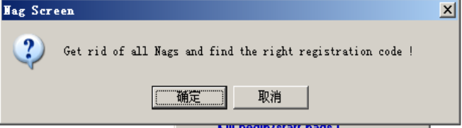
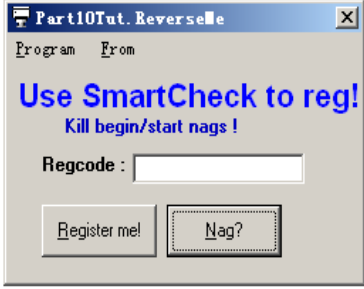
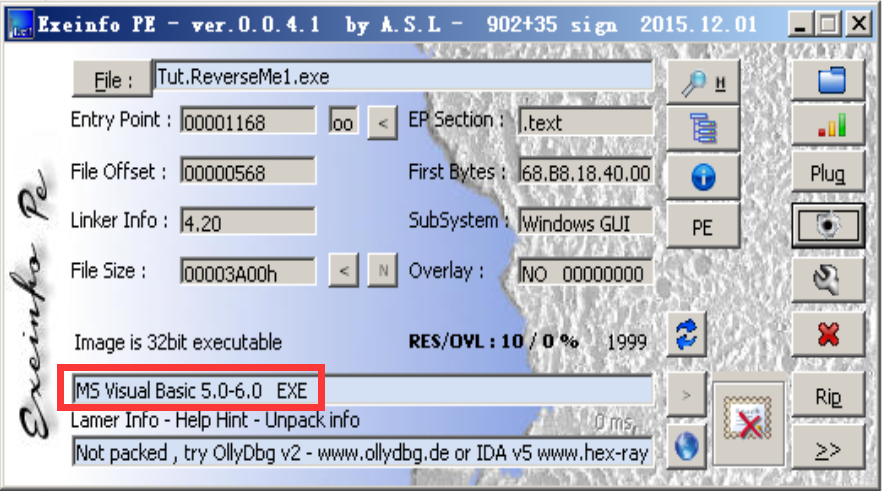
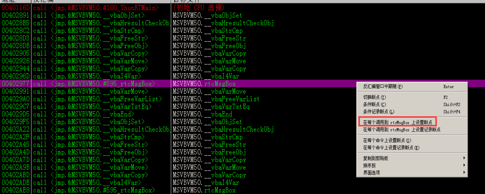
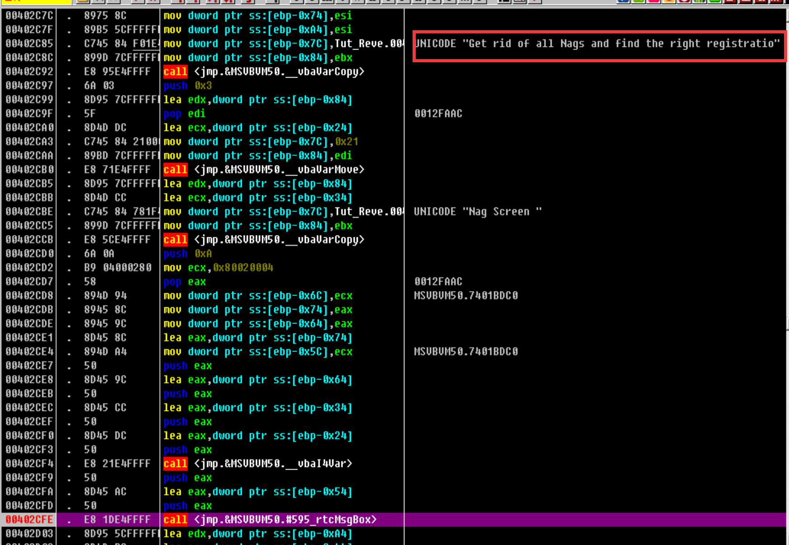
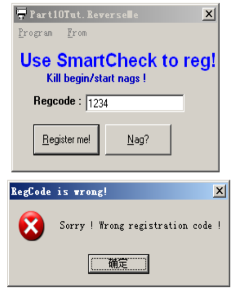
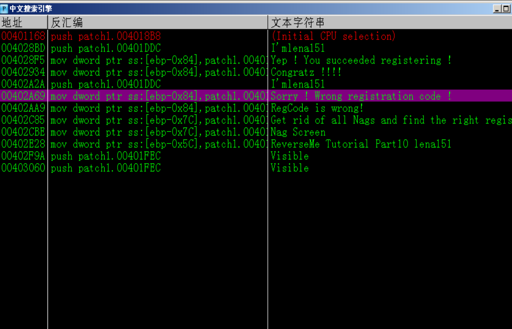
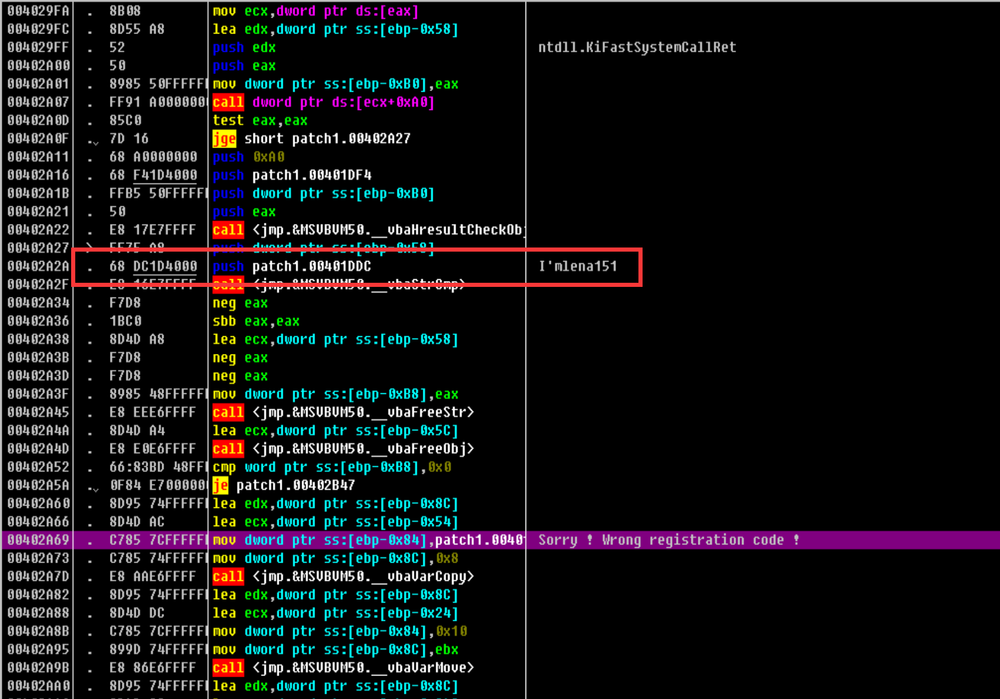
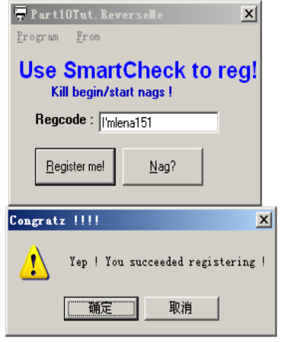

# 分析过程

## 运行

首先运行目标程序
弹出消息对话框，需要我们删除所有 Nags（唠叨）并找到正确的注册码

## 分析

### 目标 1 ：去除消息框

使用 exeinfo 查看该程序，发现是使用 Visual Basic 编写的，此处用 OllyDbg 分析的，也可以用专门调试 VB 的调试器 VB Decompiler

我们的目标 1 是去除弹出 Nags 的消息框
VB 中调用消息框的函数位 MSVNVM50.rtcMsgBox
在 OllyDbg 汇编代码框中使用鼠标右键 -> 查找 -> 所有模块间的调用，找到 MSVNVM50.rtcMsgBox 并在每个调用它的地方设置断点

按 F9 运行程序，程序运行到设有断点的地方（0x00402cfe）就停下来
从断点处往前找，可以看到消息框中显示的字符串

继续运行程序，弹出 Nag Screen 消息框，单击确定按钮，出现程序的主界面，单击 Nag? 按钮，程序运行到 0x00402cfe 处又停了下来，这与第一次停止的位置相同，所以我们只对这一处打补丁即可。

直接往上找到进入栈帧的部分，将 push ebp 改为 retn 即可。

### 目标 2：查找注册码

随便输入一个注册码，提示注册码错误

OD 中 右键搜索字符串

在字符串上面发现字符串比较函数 vbaStrCmp
而且调用函数前直接把一个字符串压入栈中作为参数，把他作为注册码，提示注册成功

